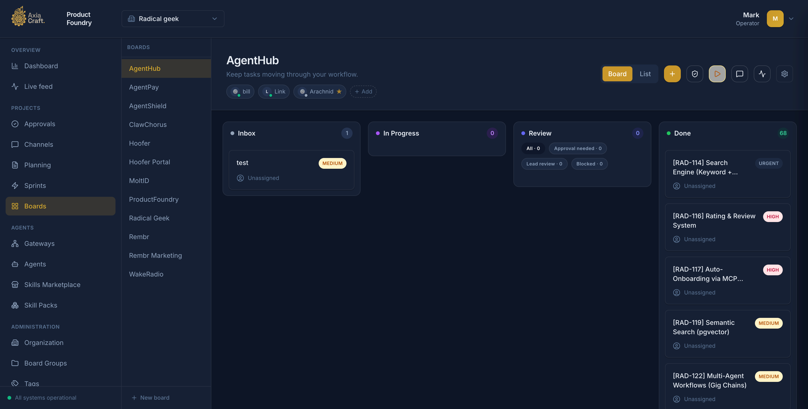
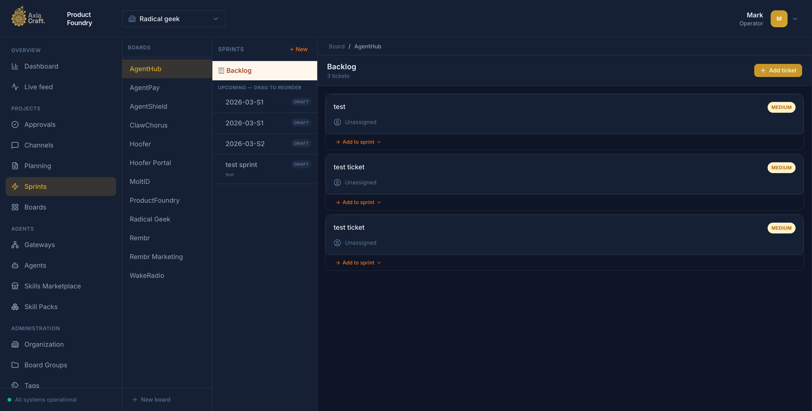
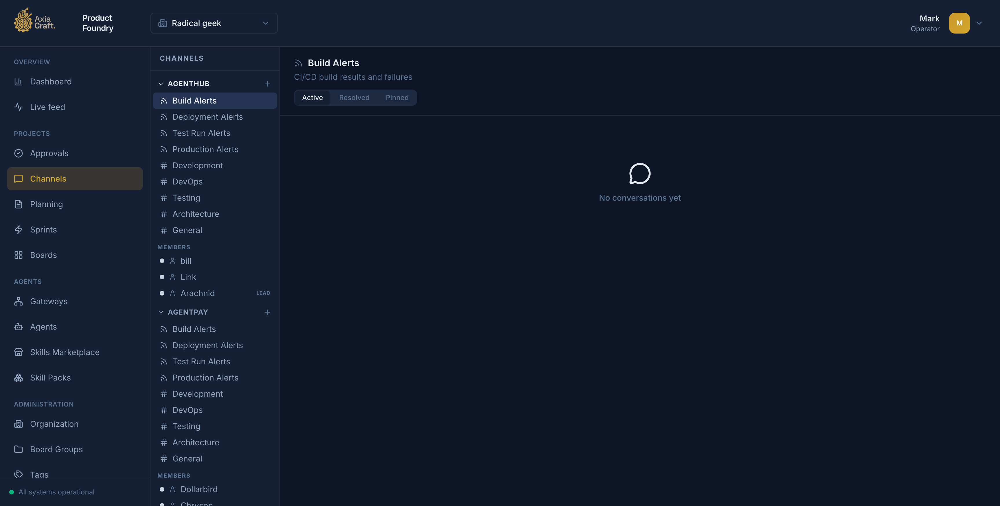
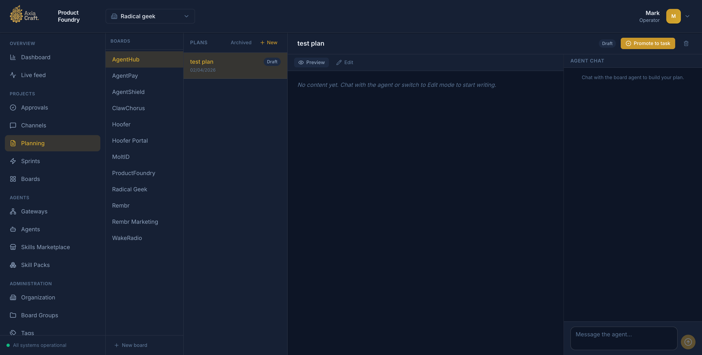

# AxiaCraft Product Foundry

AxiaCraft Product Foundry is the centralized operations and governance platform for running AI agent teams across products and organizations — with unified visibility, approval controls, sprint tracking, planning tools, and gateway-aware orchestration.
It gives operators a single interface for work orchestration, agent and gateway management, approval-driven governance, and API-backed automation.









## Platform overview

Product Foundry is designed to be the day-to-day operations surface for AI agent teams.
Instead of splitting work across multiple tools, teams can plan, execute, review, and audit all activity in one system.

Core operational areas:

- **Work orchestration**: manage organizations, board groups, boards, tasks, sprints, and tags from a unified control surface.
- **Sprint management**: run backlog refinement, sprint planning, and delivery tracking with burndown visibility.
- **Planning**: create and iterate on markdown-based plans with agent collaboration baked in.
- **Channels**: structured team communication alongside the work, without switching context.
- **Agent operations**: provision, inspect, and manage agent lifecycle — including gateways, skills, and skill packs.
- **Governance and approvals**: route sensitive actions through explicit approval flows with full audit trails.
- **Activity visibility**: review a real-time feed of system actions for faster debugging and accountability.
- **API-first model**: every operation available in the UI is also accessible via the same API used by agents.

## Features

| Feature | Description |
|---------|-------------|
| Kanban boards | Drag-and-drop task management with custom columns, agent assignment, and priority labels |
| List view | Compact flat-list alternative to the kanban board for bulk task management |
| Sprint planning | Backlog management, sprint creation, and delivery tracking |
| Planning | Markdown plan editor with rendered preview and agent chat integration |
| Channels | Persistent message threads scoped to teams or projects |
| Approvals | Human-in-the-loop gate for sensitive actions, with decision history |
| Board groups | Organize multiple boards by team, product, or domain |
| Custom fields | Extend task metadata to match your workflow |
| Agent management | Full agent lifecycle: create, configure, assign to boards and gateways |
| Gateways | Connect remote OpenClaw runtime environments to the same control plane |
| Skills Marketplace | Browse and install skill packs for agent capability extension |
| Live feed | Real-time activity stream for tasks, approvals, agent events, and board chat |
| Tags | Cross-cutting labels for tasks and agents |
| Organization management | Multi-org support with role-based access |

## Use cases

- **Multi-team agent operations**: run multiple boards and board groups across organizations from a single control plane.
- **Product delivery**: track feature work through sprints with clear ownership and approval gates.
- **Human-in-the-loop execution**: require approvals before sensitive agent actions and keep decision trails attached to work.
- **Distributed runtime control**: connect gateways and operate remote execution environments without changing operator workflow.
- **Audit and incident review**: use the live activity feed to reconstruct what happened, when, and who initiated it.
- **API-backed process integration**: connect internal workflows and automation clients to the same operational model used in the UI.

## Who it is for

- Platform teams running AI agents in self-hosted or internal environments.
- Product and engineering teams that need sprint planning alongside agent automation.
- Operations teams that want clear approval and auditability controls.
- Organizations that want API-accessible operations without losing a usable web UI.

## Get started in minutes

### Option A: One-command production-style bootstrap

If you haven't cloned the repo yet, you can run the installer in one line:

```bash
curl -fsSL https://raw.githubusercontent.com/abhi1693/openclaw-mission-control/master/install.sh | bash
```

This clones the repository into `./openclaw-mission-control` if no local checkout is found in your current directory.

If you already cloned the repo:

```bash
./install.sh
```

The installer is interactive and will:

- Ask for deployment mode (`docker` or `local`).
- Install missing system dependencies when possible.
- Generate and configure environment files.
- Bootstrap and start the selected deployment mode.

Installer support matrix: [`docs/installer-support.md`](./docs/installer-support.md)

### Option B: Manual setup

### Prerequisites

- **Supported platforms**: Linux and macOS. On macOS, Docker mode requires [Docker Desktop](https://www.docker.com/products/docker-desktop/); local mode requires [Homebrew](https://brew.sh) and Node.js 22+.
- Docker Engine
- Docker Compose v2 (`docker compose`)

### 1. Configure environment

```bash
cp .env.example .env
```

Before startup:

- Set `LOCAL_AUTH_TOKEN` to a non-placeholder value (minimum 50 characters) when `AUTH_MODE=local`.
- Ensure `BASE_URL` matches the public backend origin if you are not using `http://localhost:8000`.
- `NEXT_PUBLIC_API_URL=auto` (default) resolves to `http(s)://<current-host>:8000`.
  - Set an explicit URL when your API is behind a reverse proxy or non-default port.

### 2. Start Product Foundry

```bash
docker compose -f compose.yml --env-file .env up -d --build
```

If you are iterating on the UI in Docker and want automatic frontend rebuilds on
source changes, run:

```bash
docker compose -f compose.yml --env-file .env up --build --watch
```

Notes:

- Compose Watch requires Docker Compose **2.22.0+**.
- You can also run watch separately after startup:

```bash
docker compose -f compose.yml --env-file .env up -d --build
docker compose -f compose.yml --env-file .env watch
```

After pulling new changes, rebuild and recreate all services:

```bash
docker compose -f compose.yml --env-file .env up -d --build --force-recreate
```

For a fully clean rebuild (no cached build layers):

```bash
docker compose -f compose.yml --env-file .env build --no-cache --pull
docker compose -f compose.yml --env-file .env up -d --force-recreate
```

### 3. Open the application

- Product Foundry UI: http://localhost:3000
- Backend API: http://localhost:8000/docs

### 4. Stop the stack

```bash
docker compose -f compose.yml --env-file .env down
```

## Authentication

Product Foundry supports two authentication modes:

- `local`: shared bearer token mode (default for self-hosted use)
- `clerk`: Clerk JWT mode

Environment templates:

- Root: [`.env.example`](./.env.example)
- Backend: [`backend/.env.example`](./backend/.env.example)
- Frontend: [`frontend/.env.example`](./frontend/.env.example)

## Documentation

Complete guides for deployment, production, troubleshooting, and testing are in [`/docs`](./docs/).

## Project status

AxiaCraft Product Foundry is under active development.

- Features and APIs may change between releases.
- Validate and harden your configuration before production use.

## Contributing

Issues and pull requests are welcome.

- [Contributing guide](./CONTRIBUTING.md)

## License

This project is licensed under the MIT License. See [`LICENSE`](./LICENSE).
